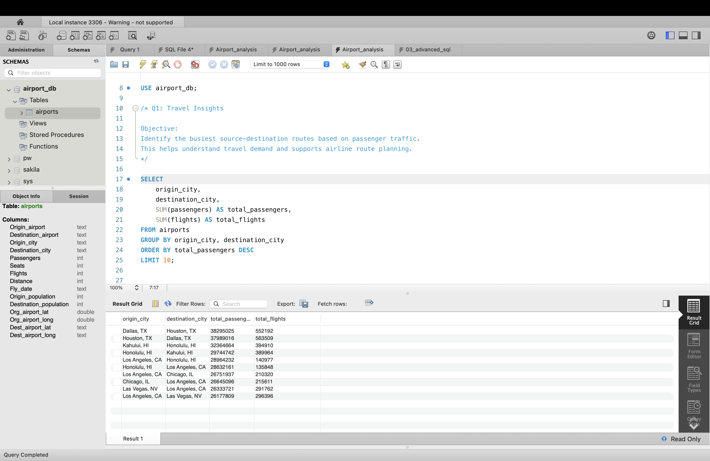
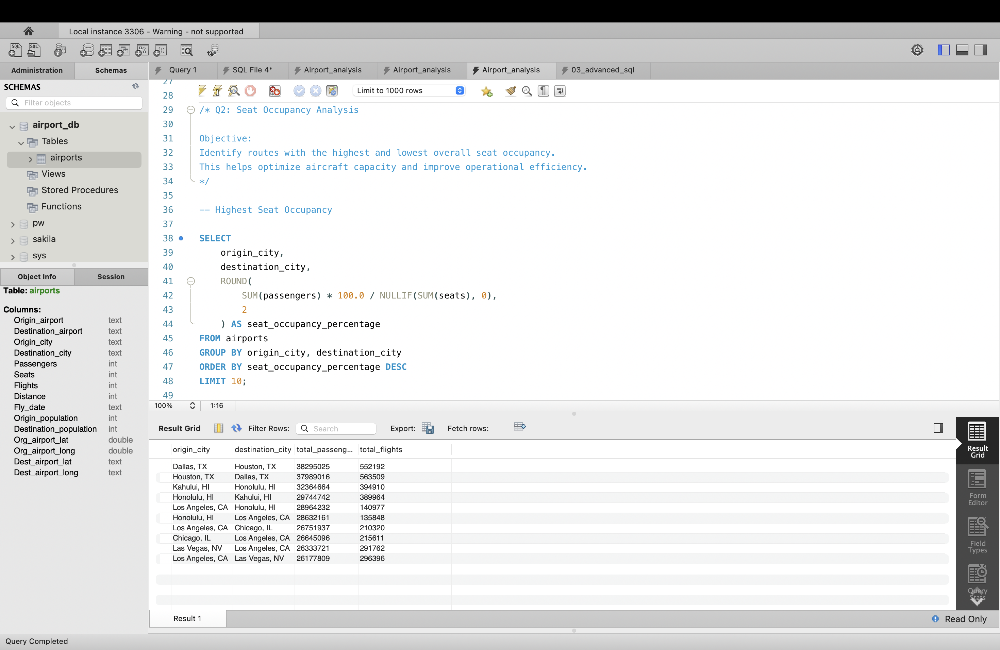
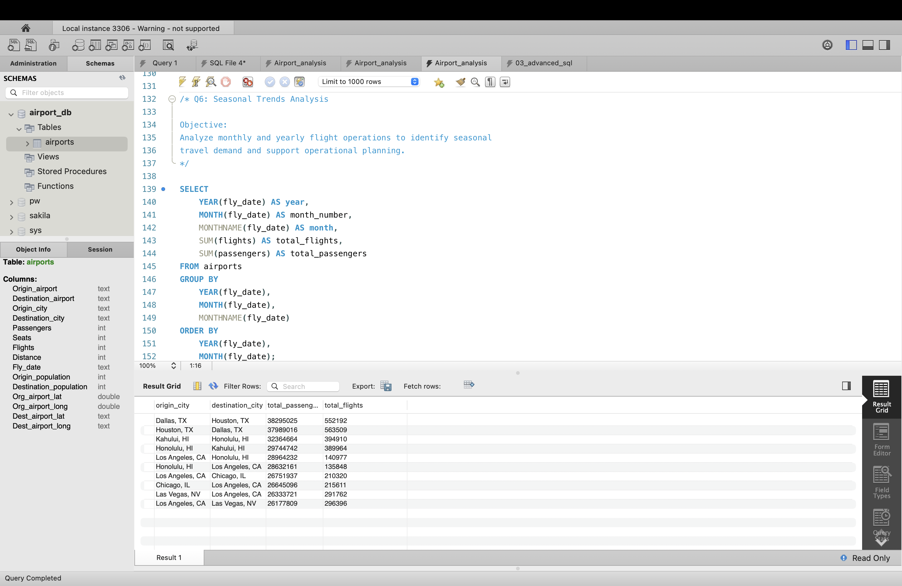
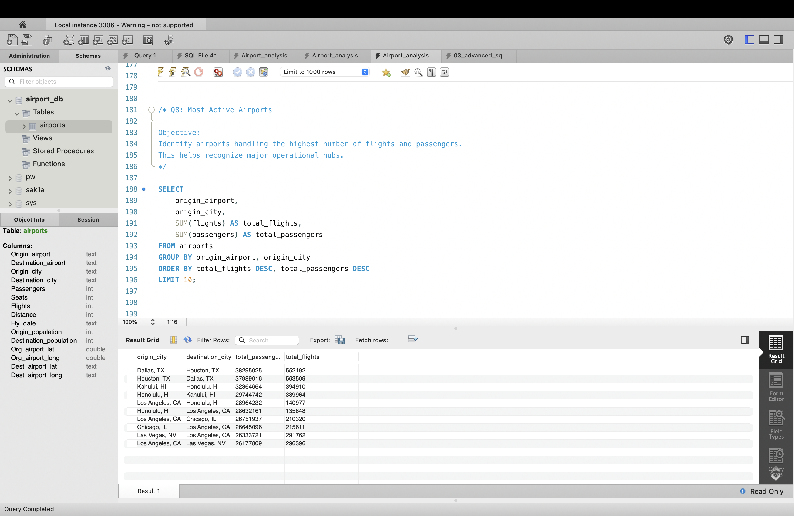
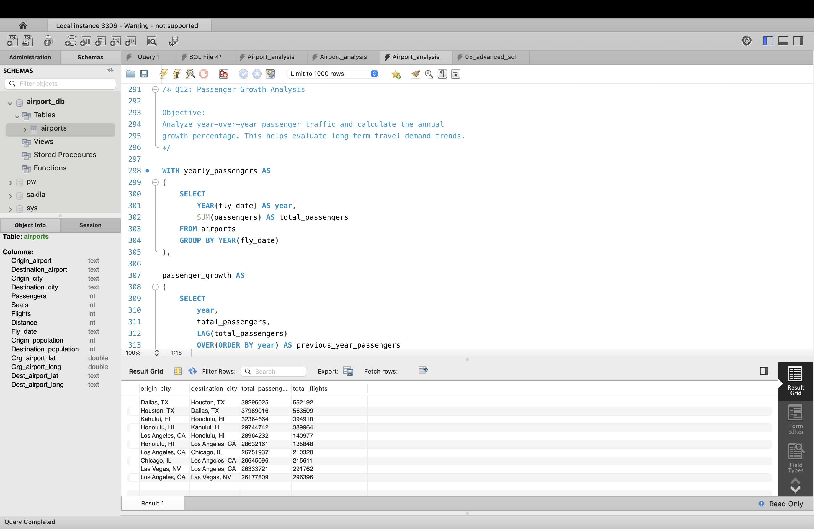
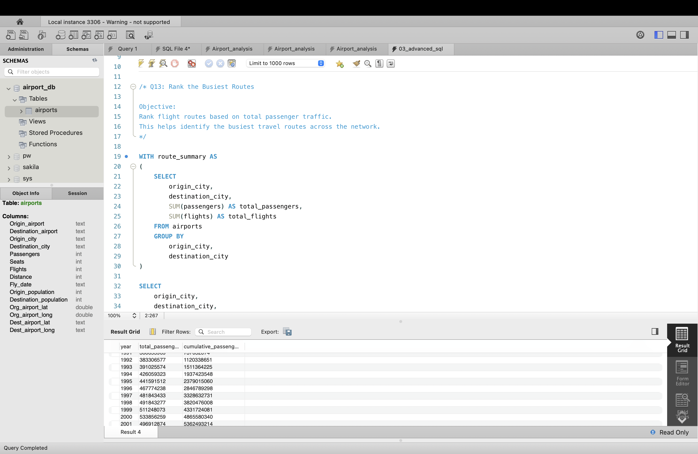
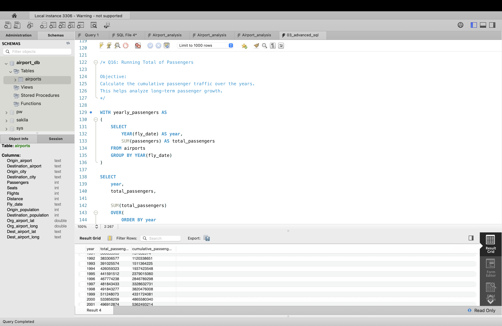
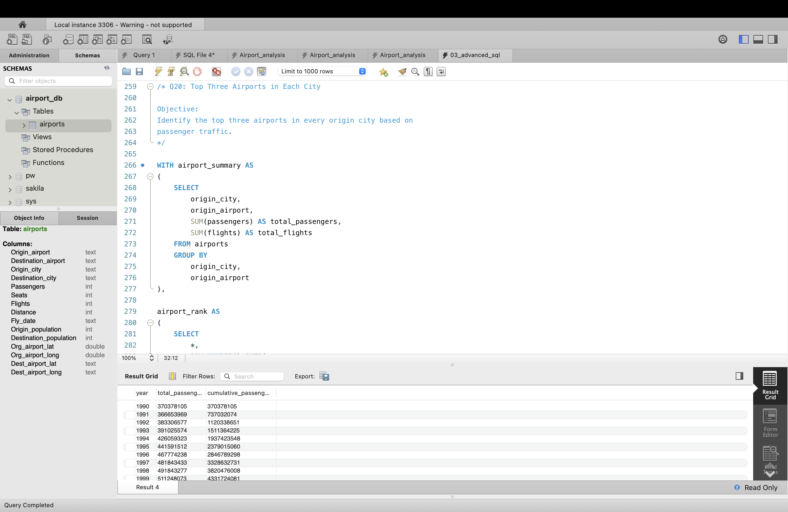

# ✈️ Airport Operations Data Analysis using SQL

## 📌 Project Overview

This project analyzes airline operations data using MySQL to uncover meaningful insights into passenger traffic, flight activity, airport performance, and travel demand.

The analysis focuses on solving real-world business problems using SQL concepts such as:
- Aggregate Functions
- GROUP BY
- Common Table Expressions (CTEs)
- Window Functions
- Ranking Functions
- Running Totals
- Date Functions
- Analytical SQL Queries

The project demonstrates practical SQL skills commonly required for Data Analyst roles.

## 🛠️ Tools & Technologies

- MySQL
- MySQL Workbench
- Git
- GitHub
- Visual Studio Code
- Markdown

## 📊 Dataset Information

- **Dataset Name:** Airport Operations Dataset
- **Database:** `airport_db`
- **Table:** `airports`
- **Total Records:** ~3.5 Million+
- **Key Features:** Origin Airport, Destination Airport, Origin City, Destination City, Flights, Passengers, Seats, Distance, Flight Date, Population, Latitude, Longitude

## 📈 Business Questions & SQL Analysis

The project answers several real-world business questions using SQL.
1. Which routes carry the highest passenger traffic?
2. Which routes have the highest and lowest seat occupancy?
3. What is the average number of passengers per flight?
4. Which cities generate the highest flight activity?
5. Which routes cover the longest average distance?
6. How do passenger and flight trends vary across months and years?
7. Which routes have low seat occupancy?
8. Which airports handle the highest number of flights and passengers?
9. Which airports have the highest network connectivity?
10. Which routes have the highest Manhattan distance?
11. How does passenger demand vary by season?
12. What is the year-over-year passenger growth?
13. Which are the busiest flight routes?
14. Which airports are the busiest within each city?
15. Which routes experience the highest passenger growth?
16. What is the cumulative passenger traffic over time?
17. Which routes rank highest by seat occupancy?
18. Which airports show the highest year-over-year growth?
19. Which months have the highest moving average of passengers?
20. Which are the top three airports in each city by passenger traffic?

## 📷 Query Results

Below are some sample outputs from the SQL analysis.

### Q1: Top 10 Busiest Routes

### Q2: Highest Seat Occupancy

### Q6: Seasonal Trends

### Q8: Most Active Airports

### Q12: Passenger Growth Analysis

### Q13: Rank the Busiest Routes

### Q16: Running Total of Passengers

### Q20: Top Three Airports in Each City
